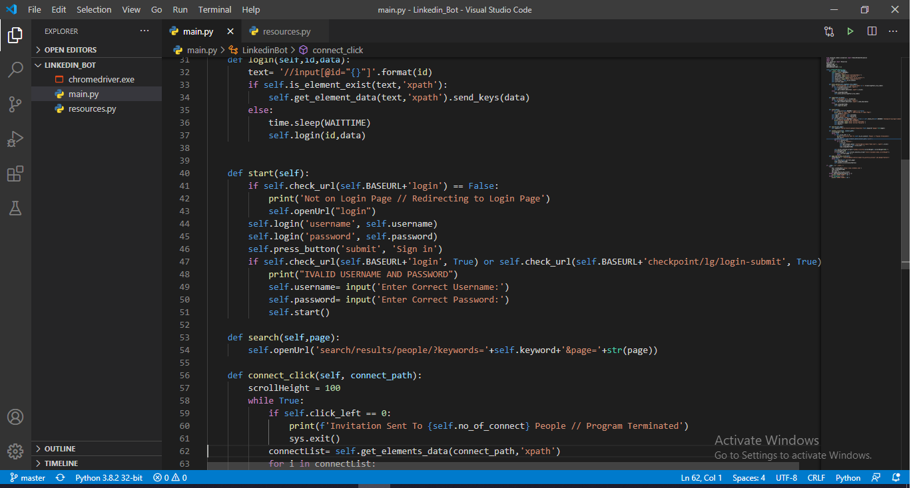

# Linkedin-Bot

Increase your likelihood to grow your connections and potentially to get interview opportunities on LinkedIn by increasing visibility of your profile by sending the connect request.

## About

LinkedIn is the world's largest professional network on the internet. You can use LinkedIn to find the right job or internship, connect and strengthen professional. A social network that focuses on professional networking and career development. You can use LinkedIn to display your resume, search for jobs, and enhance your professional reputation by posting updates and interacting with other people.  The first step in LinkedIn is to make connections and which will help in increasing the visibility of users across the platform. 

<p align="center">
  
</p>

## Requirements

LinkedInBot was developed under [Pyhton 2.7](https://www.python.org/downloads/).

Note: Python 2.7.9 and later (on the python2 series), and Python 3.4 and later include pip by default, so you may have pip already. Otherwise, you can install [easy_install](https://pythonhosted.org/setuptools/easy_install.html) `sudo apt-get install python-setuptools` to install [pip](https://pypi.python.org/pypi/pip) `sudo easy_install pip`.

- [Selenium](http://www.seleniumhq.org/), for browser automation: `pip install Selenium`

For Chrome, first get the [webdriver](https://sites.google.com/a/chromium.org/chromedriver/downloads) then put it in the same folder than the bot if you are on Windows, or in the `/usr/bin` folder if you are on OS X.

## Inputs

When `main.py` will is executed, certain inputs are asked from the user:
- Email: Users need to enter the valid Email Address to the input field. [INPUT TYPE: String (words)]
- Password: Users need to enter the valid password corresponding to the Email address entered in the input field. [INPUT TYPE: String (words)]
- No Connect: Users need to specify How many connect request program need to send. [INPUT TYPE: INTEGER (Number)]
- Keyword: Users need to enter the type of people bot need to connect on Linkedin. Like "Web developer", "Marketing", "HR". [INPUT TYPE: String (words)]


## Configuration (Optional)
You can hard code the variable value in the program to avoid entering multiple times when you run the program and to do so
Before you run the bot, replace the configuration portion of the script. This will include your account login information (email, password, etc.) and other logical values to make the bot more of your own. It's that simple!

```python
# Configurable Constants
#--------------------------
self.username= input("Enter Username/Email:") #line 14 
#Replace With 
self.username= 'YOUR EMAIL/USERNAME FOR LINKEDIN ACCOUNT'
#--------------------------
self.password= input("Enter Password:") #line 15
#Replace With 
self.password= 'YOUR PASSWORD FOR LINKEDIN ACCOUNT'
#--------------------------
self.no_of_connect= input("Enter no_of_connect:") #line 16
#Replace With
self.no_of_connect= 'THE NUMBER OF PEOPLE YOU WANT TO CONNECT WITH'
#--------------------------
self.keyword = input("Enter Keyword/Text:") #line 17 
#Replace With 
self.keyword = 'KEYWORD THAT BOT WILL TARGET'
#--------------------------
```

## Run
Make sure you are in the correct folder and run the following command: `python main.py`

## Enhancements
Please feel free to message me or open an issue if you have an idea for an enhancement! Seems like people are starting to use this and I would like to improve it.

## LICENCE
[wtfpl](http://www.wtfpl.net/about/)
